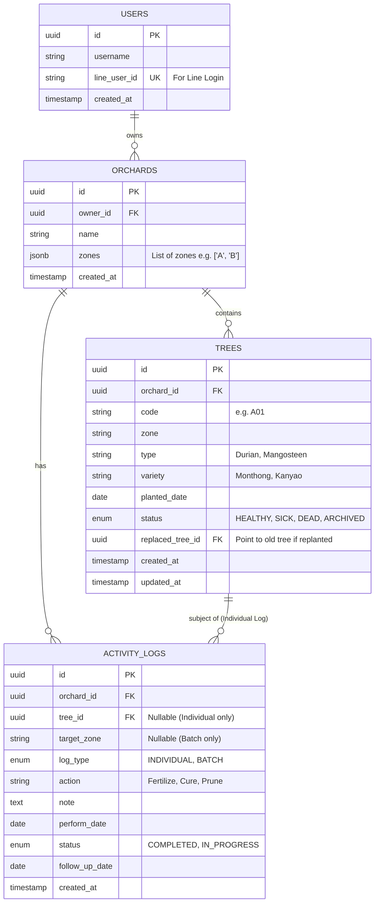

# Database Schema Design for Clurian - Orchard Manager

เอกสารนี้ระบุการออกแบบฐานข้อมูล (Database Schema) สำหรับระบบ Clurian โดยอ้างอิงจากฟีเจอร์และการทำงานที่วิเคราะห์จาก `docs/index.html`

## 1. Overview

ระบบเน้นการเก็บข้อมูลแบบ Relational Database เพื่อรองรับความสัมพันธ์ระหว่าง สวน (Orchard), ต้นไม้ (Tree) และ กิจกรรม (Activity Logs) โดยมีการออกแบบให้รองรับการขยายตัวในอนาคต (Scalable)

### Key Features Supported:
- **Multi-Tenancy**: รองรับผู้ใช้งานหลายคน และหนึ่งคนมีได้หลายสวน
- **Tree Lifecycle**: รองรับสถานะ ปกติ/ป่วย/ตาย และประวัติการปลูกซ่อม (Replanting history)
- **Hybrid Logging**: รองรับการบันทึกกิจกรรมทั้งแบบรายต้น (Individual) และเหมาแปลง (Batch)
- **Health Tracking**: ระบบติดตามวันนัดหมาย (Follow-up)

---

## 2. ER Diagram



---

## 3. Table Specifications

### 3.1 Users (ผู้ใช้งาน)
เก็บข้อมูลผู้ใช้งานและ Credential สำหรับการ Login

| Column Name | Data Type | Constraint | Description |
|---|---|---|---|
| `id` | UUID | PK | รหัสผู้ใช้งาน |
| `display_name` | VARCHAR(255) | | ชื่อที่แสดงในระบบ |
| `line_user_id` | VARCHAR(255) | UNIQUE | ID จาก LINE Login (ใช้เป็น Primary Credential) |
| `created_at` | TIMESTAMP | DEFAULT NOW() | วันที่สมัครสมาชิก |

### 3.2 Orchards (สวน)
หนึ่ง User สามารถเป็นเจ้าของได้หลายสวน

| Column Name | Data Type | Constraint | Description |
|---|---|---|---|
| `id` | UUID | PK | รหัสสวน |
| `owner_id` | UUID | FK -> Users.id | เจ้าของสวน |
| `name` | VARCHAR(255) | NOT NULL | ชื่อสวน |
| `zones` | JSONB | DEFAULT '[]' | รายชื่อโซนทั้งหมดในสวน เช่น `["A", "B", "ริมน้ำ"]` (ใช้ JSON เพื่อความยืดหยุ่นในการเพิ่มลดโซนง่ายๆ) |
| `created_at` | TIMESTAMP | DEFAULT NOW() | |

### 3.3 Trees (ทะเบียนต้นไม้)
เก็บข้อมูล Master Data ของต้นไม้แต่ละต้น

| Column Name | Data Type | Constraint | Description |
|---|---|---|---|
| `id` | UUID | PK | รหัสอ้างอิงต้นไม้ (System ID) |
| `orchard_id` | UUID | FK -> Orchards.id | สังกัดสวนไหน |
| `code` | VARCHAR(50) | NOT NULL | รหัสต้นไม้ที่เรียกขาน (เช่น A01, B15) |
| `zone` | VARCHAR(50) | NOT NULL | โซนที่ปลูก (ต้องตรงกับค่าใน Orchards.zones) |
| `type` | VARCHAR(50) | | ชนิดพืช (ทุเรียน, มังคุด) |
| `variety` | VARCHAR(50) | | สายพันธุ์ (หมอนทอง, ก้านยาว) |
| `planted_date` | DATE | | วันที่ปลูก |
| `status` | ENUM | NOT NULL | สถานะปัจจุบัน: `HEALTHY`, `SICK`, `DEAD`, `ARCHIVED` |
| `replaced_tree_id`| UUID | FK -> Trees.id | (Self-Ref) หากเป็นการปลูกซ่อม จะเก็บ ID ของต้นเก่าที่ถูกแทนที่ไว้ตรงนี้เพื่อ Trace กลับได้ |
| `created_at` | TIMESTAMP | DEFAULT NOW() | |
| `updated_at` | TIMESTAMP | | อัพเดทล่าสุดเมื่อไหร่ |

> **Note on Replanting:** เมื่อมีการปลูกซ่อม ต้นเดิมจะถูกเปลี่ยน `status` เป็น `ARCHIVED` และระบบจะสร้าง Row ใหม่สำหรับต้นใหม่ โดยใส่ `replaced_tree_id` ชี้ไปที่ต้นเดิม

### 3.4 Activity Logs (บันทึกกิจกรรม)
ตาราง Transaction หลัก เก็บทุกกิจกรรมที่เกิดขึ้นในสวน

| Column Name | Data Type | Constraint | Description |
|---|---|---|---|
| `id` | UUID | PK | |
| `orchard_id` | UUID | FK -> Orchards.id | |
| `log_type` | ENUM | NOT NULL | ประเภทกิจกรรม: `INDIVIDUAL` (รายต้น), `BATCH` (เหมา) |
| `tree_id` | UUID | FK -> Trees.id | (Nullable) ระบุเฉพาะเมื่อ log_type = INDIVIDUAL |
| `target_zone` | VARCHAR(50) | | (Nullable) ระบุเฉพาะเมื่อ log_type = BATCH (ว่างได้ถ้าเหมาทั้งสวน) |
| `action` | VARCHAR(100) | NOT NULL | ชื่อกิจกรรม (ใส่ปุ๋ย, พ่นยา, รักษาโรค) |
| `note` | TEXT | | รายละเอียดเพิ่มเติม / อาการที่พบ |
| `perform_date` | DATE | NOT NULL | วันที่ทำกิจกรรมจริง |
| `status` | ENUM | DEFAULT 'COMPLETED' | `COMPLETED` (เสร็จแล้ว), `IN_PROGRESS` (รอติดตามผล) |
| `follow_up_date` | DATE | | (Nullable) วันนัดดูอาการครั้งถัดไป |
| `created_at` | TIMESTAMP | DEFAULT NOW() | |

---

## 4. Indexes & Performance Optimization

เพื่อประสิทธิภาพในการ Query และค้นหาข้อมูล ควรสร้าง Index ดังนี้:

1.  **Orchard Access:** `INDEX idx_orchards_owner (owner_id)`
2.  **Tree Lookup:** `INDEX idx_trees_orchard_code (orchard_id, code)` (ค้นหาต้นไม้ในสวนด้วยรหัส)
3.  **Active Trees:** `INDEX idx_trees_status (orchard_id, status)` (สำหรับหน้า Dashboard นับจำนวนต้น)
4.  **Log History:** `INDEX idx_logs_tree_date (tree_id, perform_date DESC)` (ดึงประวัติรายต้น เรียงเวลายุ้อนหลัง)
5.  **Follow-up Queue:** `INDEX idx_logs_followup (orchard_id, status, follow_up_date)` (สำหรับดึงรายการที่ต้องติดตามอาการ)

## 5. View / Logical Abstractions

### IsCurrentTree (Logic)
ในการ Query ต้นไม้ปัจจุบันที่ไม่ใช่ Archive:
```sql
SELECT * FROM trees WHERE orchard_id = ? AND status != 'ARCHIVED'
```

### Dashboard Stats (Logic)
การดึงตัวเลขหน้า Dashboard:
```sql
-- Count All Active
SELECT count(*) FROM trees WHERE orchard_id = ? AND status != 'ARCHIVED'
-- Count Sick
SELECT count(*) FROM trees WHERE orchard_id = ? AND status = 'SICK'
```
